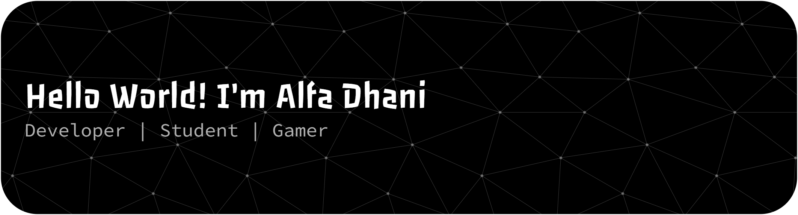

<!-- ## Hi there 👋

### Im, Alfa Dhani Fahrezan -->

<!-- - 🌱 I’m currently learning [**React JS**](https://react.dev/) -->

##### Skills
###### Programing

###### Design

###### Connect with Me
 
<!--
**ALFADHANI284/ALFADHANI284** is a ✨ _special_ ✨ repository because its `README.md` (this file) appears on your GitHub profile.

Here are some ideas to get you started:

- 🔭 I’m currently working on ...
- 🌱 I’m currently learning ...s
- 👯 I’m looking to collaborate on ...
- 🤔 I’m looking for help with ...
- 💬 Ask me about ...
- 📫 How to reach me: ...
- 😄 Pronouns: ...
- ⚡ Fun fact: ...
-->

##### My Github Stats

